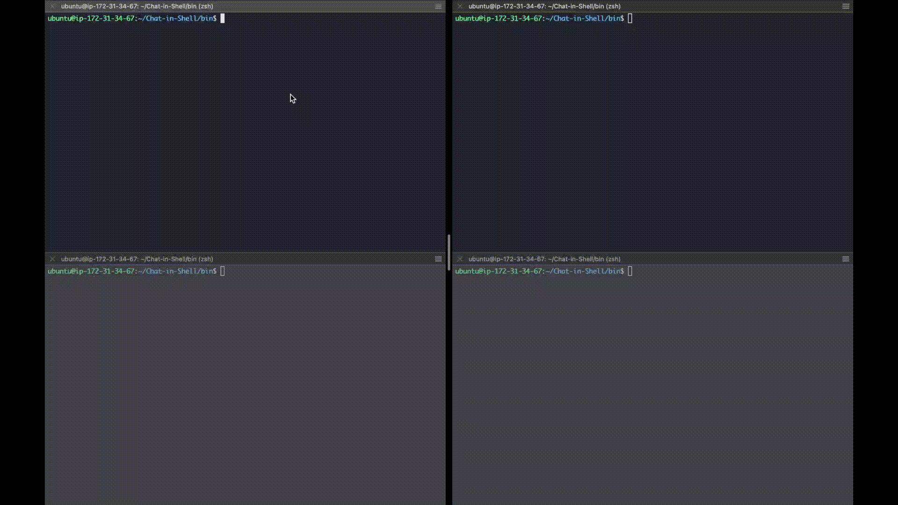
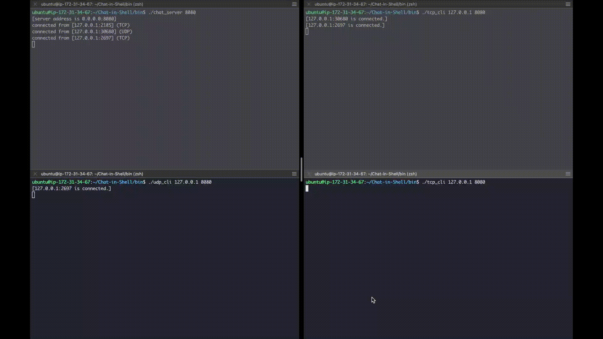
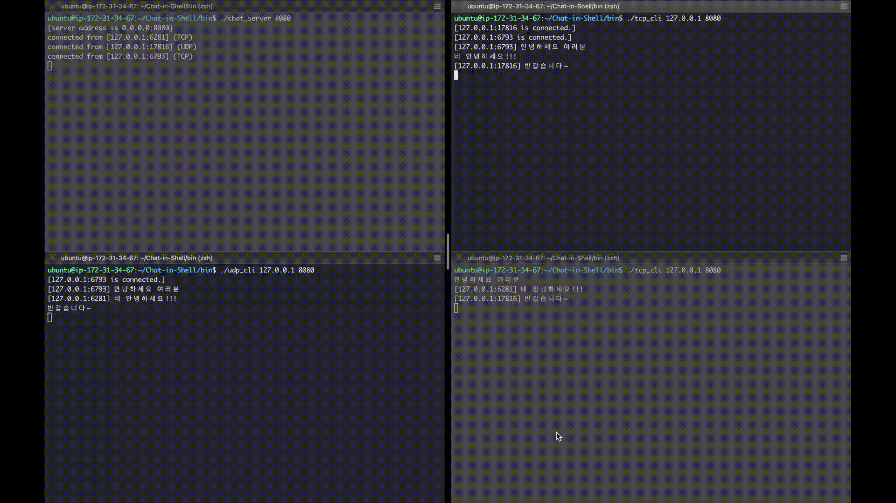
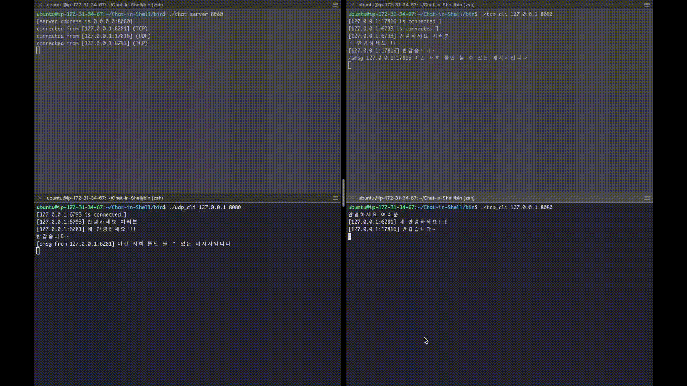
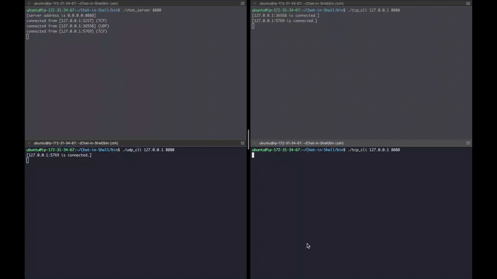

# Chat-in-Shell
C언어로 구현한 콘솔 채팅 프로그램

## How?
채팅 서버는 TCP, UDP 클라이언트를 모두 수용하기 위해서 `Select()` 함수를 이용하여 이벤트가 발생할 때까지 대기한다.

> Socket, Listen, Select 와 같이 첫 글자가 대문자인 함수는 기존 socket, listen, select 함수에 예외 처리를 포함하여 재정의한 함수이다. libunp 라이브러리에 정의되어 있다.

서버 및 클라이언트는 일반적인 채팅 기능인 broadcast 기능(클라이언트의 채팅을 다른 모든 접속자에게 알림)과 더불어, 클라이언트는 그 외에 부가적인 기능을 제공한다.
- `/list` : 현재 클라이언트 목록
- `/smsg [IP_ADDRRES:PORT] [MESSAGE]` : 특정 클라이언트에게 메시지 전달
- `/quit` : 클라이언트 종료

서버는 TCP와 UDP 사용자 풀(pool)을 각각 관리한다. 위 부가기능들에 대해서 각 사용자 풀을 탐색하여 로직을 수행한다.

클라이언트의 종료는 TCP의 경우 FIN 패킷을 통해 처리할 수 있지만, UDP의 경우 명령어 `/quit`을 사용하지 않으면 처리할 수 없다. 이러한 문제는 타임 아웃을 설정하여 보완할 수 있다.


## Demo
1개의 서버(왼쪽 위), 3개의 클라이언트가 채팅을 하는 데모 화면이다. 

### Connect
<br>
먼저 서버를 실행시키고, 클라이언트를 하나씩 실행시켜 서버에 접속한다. 채팅 중에 다른 클라이언트가 접속한다면 `[127.0.0.1:12345 is connected]`와 같은 메시지를 받을 수 있다.

### User list
<br>
서버에 접속되면 클라이언트는 `/list`를 입력하여 현재 접속중인 사용자 목록을 확인할 수 있다. 본인의 행에는 `me` 키워드가 붙어있다.

### Whisper
<br>
`/smsg [CLIENT_IP:PORT] [MESSAGE]`를 통해서 특정 사용자에게만 메시지를 전달할 수 있다. 오른쪽 위의 클라이언트가 왼쪽 아래의 클라이언트에게 귓속말을 보내고 있다. 귓속말 이므로 오른쪽 아래 클라이언트는 해당 메시지를 볼 수 없다.

### Quit
<br>
`/quit` 명령어를 입력하면 채팅을 종료한다. `[127.0.0.1:12345 exits]`와 같은 메시지를 다른 모두에게 전달한다.

### Chatting
<br>
명령어가 아닌 문자열을 입력하면 접속 중인 모든 사용자에게 메시지를 전달한다.

### Demo environment
- Ubuntu 20.04
- gcc 9.3.0

## Get started
### Compile
```
gcc -Iunpv13e/lib -o bin/chat_server chat_srv_tcpudp.c unpv13e/libunp.a -lpthread
gcc -Iunpv13e/lib -o bin/tcp_cli tcp_cli.c unpv13e/libunp.a -lpthread
gcc -Iunpv13e/lib -o bin/udp_cli udp_cli.c unpv13e/libunp.a -lpthread
```
> 각 소스 코드는 `unp.h`파일을 필요로 하기 때문에 unpv13e 라이브러리 빌드가 선행되어야 한다. (이미 빌드되어 있으므로 신경쓰지 않아도 된다)

### Run
```
# Server
./bin/chat_server [PORT_NUMBER]

# Client - TCP
./bin/tcp_cli [SERVER_IP] [SERVER_PORT]

# Client - UDP
./bin/udp_cli [SERVER_IP] [SERVER_PORT]
```

